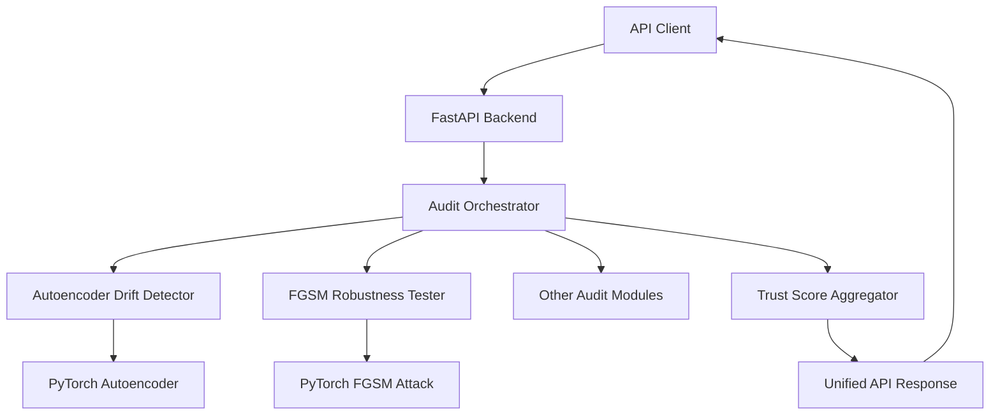
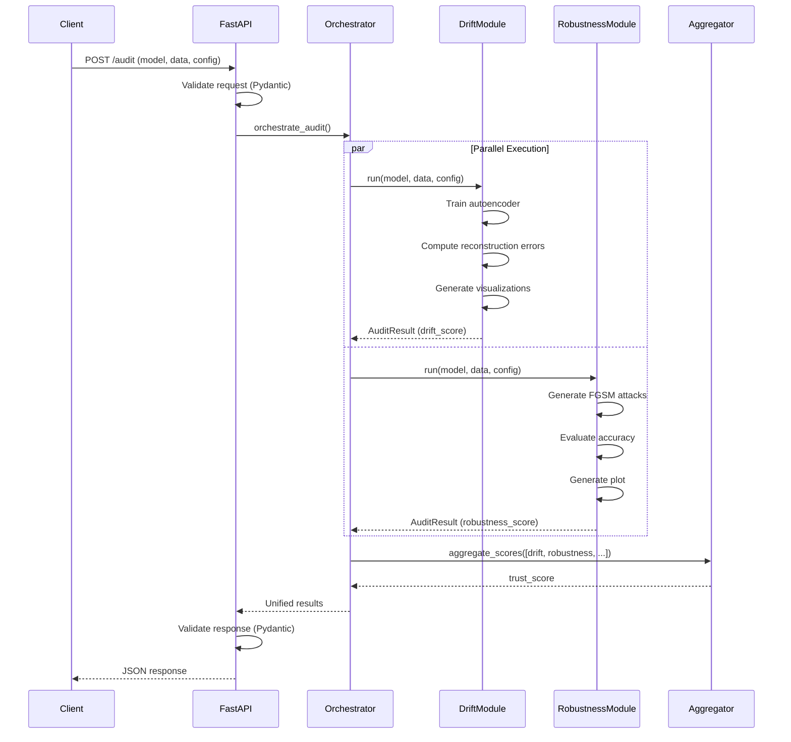

# Design Document: Backend Deep Learning Integration

## Overview

This design specifies the technical architecture for integrating two deep learning audit modules (Autoencoder Drift Detector and FGSM Adversarial Robustness Tester) into the TrustLens FastAPI backend. The system provides async REST endpoints for model auditing, implements a common audit module interface, aggregates results into a unified trust score, and follows production-ready patterns for deployment.

### Key Design Goals

1. **Modularity**: Common interface allows seamless integration of new audit modules
2. **Async Performance**: All endpoints use async/await for concurrent request handling
3. **Type Safety**: Pydantic v2 models enforce validation at API boundaries
4. **Deployment Ready**: Environment-based configuration and containerization support
5. **Extensibility**: Trust score aggregation supports dynamic module composition

### Technology Stack

- **FastAPI**: Async web framework with automatic OpenAPI documentation
- **Pydantic v2**: Request/response validation and serialization
- **PyTorch**: Deep learning framework for autoencoder and FGSM implementation
- **python-dotenv**: Environment variable management
- **matplotlib**: Visualization generation (training curves, histograms, plots)
- **numpy**: Numerical operations for score calculations

## Architecture

### High-Level System Architecture



### Component Responsibilities

**FastAPI Backend**
- Expose REST endpoints for audit operations
- Validate requests/responses using Pydantic models
- Handle async request processing
- Load configuration from environment variables

**Audit Orchestrator**
- Instantiate and invoke audit modules
- Collect results from multiple modules
- Pass results to Trust Score Aggregator
- Format unified API responses

**Audit Modules (Base Interface)**
- Implement common `run(model, data, config)` interface
- Return standardized `AuditResult` objects
- Generate module-specific visualizations
- Calculate normalized scores (0-1 range)

**Autoencoder Drift Detector**
- Train PyTorch autoencoder on reference data
- Compute reconstruction errors on test data
- Calculate drift score from error statistics
- Generate training loss and error histogram visualizations

**FGSM Robustness Tester**
- Implement FGSM attack using PyTorch autograd
- Evaluate model accuracy across epsilon values
- Calculate robustness score from accuracy degradation
- Generate accuracy-vs-epsilon visualization

**Trust Score Aggregator**
- Accept scores from multiple audit dimensions
- Compute weighted average with configurable weights
- Handle missing dimensions with weight renormalization
- Return normalized trust score (0-1 range)

### Data Flow



## Components and Interfaces

### API Endpoints

#### POST /audit/drift

Detects distribution drift using autoencoder reconstruction error.

**Request Body:**
```python
{
    "reference_data": [[float]],  # Training/baseline data
    "test_data": [[float]],       # Data to evaluate for drift
    "config": {
        "threshold": 0.7,          # Drift detection threshold
        "epochs": 50,              # Autoencoder training epochs
        "learning_rate": 0.001,    # Optimizer learning rate
        "hidden_dim": 32           # Autoencoder hidden dimension
    }
}
```

**Response Body:**
```python
{
    "status": "success",
    "message": "Drift detection completed",
    "data": {
        "score": 0.65,
        "is_drift_detected": false,
        "metadata": {
            "mean_reconstruction_error": 0.042,
            "std_reconstruction_error": 0.018,
            "training_loss_plot": "data:image/png;base64,...",
            "error_histogram": "data:image/png;base64,..."
        }
    }
}
```

#### POST /audit/robustness

Evaluates adversarial robustness using FGSM attacks.

**Request Body:**
```python
{
    "model_path": "path/to/model.pth",  # Path to PyTorch model
    "test_data": [[float]],              # Test samples
    "test_labels": [int],                # True labels
    "config": {
        "epsilon_values": [0.0, 0.01, 0.05, 0.1, 0.2, 0.3],
        "loss_function": "cross_entropy"
    }
}
```

**Response Body:**
```python
{
    "status": "success",
    "message": "Robustness testing completed",
    "data": {
        "score": 0.78,
        "metadata": {
            "clean_accuracy": 0.95,
            "accuracy_per_epsilon": {
                "0.0": 0.95,
                "0.01": 0.92,
                "0.05": 0.85,
                "0.1": 0.72,
                "0.2": 0.58,
                "0.3": 0.45
            },
            "accuracy_plot": "data:image/png;base64,..."
        }
    }
}
```

#### POST /audit/aggregate

Computes unified trust score from multiple audit dimensions.

**Request Body:**
```python
{
    "scores": {
        "explainability": 0.82,
        "fairness": 0.75,
        "calibration": 0.88,
        "drift": 0.65,
        "robustness": 0.78
    },
    "weights": {  # Optional, defaults to equal weights
        "explainability": 0.2,
        "fairness": 0.2,
        "calibration": 0.2,
        "drift": 0.2,
        "robustness": 0.2
    }
}
```

**Response Body:**
```python
{
    "status": "success",
    "message": "Trust score aggregation completed",
    "data": {
        "trust_score": 0.776,
        "metadata": {
            "weights_used": {
                "explainability": 0.2,
                "fairness": 0.2,
                "calibration": 0.2,
                "drift": 0.2,
                "robustness": 0.2
            },
            "contributing_scores": {
                "explainability": 0.82,
                "fairness": 0.75,
                "calibration": 0.88,
                "drift": 0.65,
                "robustness": 0.78
            }
        }
    }
}
```

### Pydantic Models

#### Base Response Model

```python
from pydantic import BaseModel, Field
from typing import Any, Literal

class APIResponse(BaseModel):
    """Standard response format for all endpoints"""
    status: Literal["success", "error"]
    message: str
    data: dict[str, Any] | None = None
```

#### Drift Detection Models

```python
class DriftDetectionConfig(BaseModel):
    """Configuration for drift detection"""
    threshold: float = Field(default=0.7, ge=0.0, le=1.0)
    epochs: int = Field(default=50, ge=1)
    learning_rate: float = Field(default=0.001, gt=0.0)
    hidden_dim: int = Field(default=32, ge=1)

class DriftDetectionRequest(BaseModel):
    """Request payload for drift detection endpoint"""
    reference_data: list[list[float]]
    test_data: list[list[float]]
    config: DriftDetectionConfig = Field(default_factory=DriftDetectionConfig)

class DriftDetectionResult(BaseModel):
    """Result from drift detection module"""
    score: float = Field(ge=0.0, le=1.0)
    is_drift_detected: bool
    metadata: dict[str, Any]
```

#### Robustness Testing Models

```python
class RobustnessTestingConfig(BaseModel):
    """Configuration for adversarial robustness testing"""
    epsilon_values: list[float] = Field(
        default=[0.0, 0.01, 0.05, 0.1, 0.2, 0.3]
    )
    loss_function: Literal["cross_entropy", "mse"] = "cross_entropy"

class RobustnessTestingRequest(BaseModel):
    """Request payload for robustness testing endpoint"""
    model_path: str
    test_data: list[list[float]]
    test_labels: list[int]
    config: RobustnessTestingConfig = Field(
        default_factory=RobustnessTestingConfig
    )

class RobustnessTestingResult(BaseModel):
    """Result from robustness testing module"""
    score: float = Field(ge=0.0, le=1.0)
    metadata: dict[str, Any]
```

#### Trust Score Aggregation Models

```python
class TrustScoreRequest(BaseModel):
    """Request payload for trust score aggregation"""
    scores: dict[str, float]
    weights: dict[str, float] | None = None

class TrustScoreResult(BaseModel):
    """Result from trust score aggregation"""
    trust_score: float = Field(ge=0.0, le=1.0)
    metadata: dict[str, Any]
```

### Audit Module Class Hierarchy

```python
from abc import ABC, abstractmethod
from dataclasses import dataclass
from typing import Any

@dataclass
class AuditResult:
    """Standardized result from any audit module"""
    score: float  # Normalized 0-1
    metadata: dict[str, Any]  # Module-specific outputs

class AuditModule(ABC):
    """Base interface for all audit modules"""
    
    @abstractmethod
    async def run(
        self,
        model: Any,
        data: dict[str, Any],
        config: dict[str, Any]
    ) -> AuditResult:
        """
        Execute audit module
        
        Args:
            model: Model to audit (format depends on module)
            data: Input data for auditing
            config: Module-specific configuration
            
        Returns:
            AuditResult with score and metadata
        """
        pass
```

#### Autoencoder Drift Detector Implementation

```python
import torch
import torch.nn as nn
import numpy as np
from typing import Any

class AutoencoderModel(nn.Module):
    """Simple autoencoder for drift detection"""
    
    def __init__(self, input_dim: int, hidden_dim: int):
        super().__init__()
        self.encoder = nn.Sequential(
            nn.Linear(input_dim, hidden_dim),
            nn.ReLU()
        )
        self.decoder = nn.Sequential(
            nn.Linear(hidden_dim, input_dim)
        )
    
    def forward(self, x):
        encoded = self.encoder(x)
        decoded = self.decoder(encoded)
        return decoded

class AutoencoderDriftDetector(AuditModule):
    """Detects distribution drift using reconstruction error"""
    
    async def run(
        self,
        model: None,  # Not used, trains own autoencoder
        data: dict[str, Any],
        config: dict[str, Any]
    ) -> AuditResult:
        """
        Train autoencoder on reference data and evaluate test data
        
        Args:
            model: Unused (trains own autoencoder)
            data: Dict with 'reference_data' and 'test_data' keys
            config: Dict with 'threshold', 'epochs', 'learning_rate', 'hidden_dim'
            
        Returns:
            AuditResult with drift score and visualizations
        """
        # Extract data and config
        reference_data = torch.tensor(data['reference_data'], dtype=torch.float32)
        test_data = torch.tensor(data['test_data'], dtype=torch.float32)
        
        threshold = config.get('threshold', 0.7)
        epochs = config.get('epochs', 50)
        learning_rate = config.get('learning_rate', 0.001)
        hidden_dim = config.get('hidden_dim', 32)
        
        # Train autoencoder
        input_dim = reference_data.shape[1]
        autoencoder = AutoencoderModel(input_dim, hidden_dim)
        optimizer = torch.optim.Adam(autoencoder.parameters(), lr=learning_rate)
        criterion = nn.MSELoss()
        
        training_losses = []
        for epoch in range(epochs):
            optimizer.zero_grad()
            reconstructed = autoencoder(reference_data)
            loss = criterion(reconstructed, reference_data)
            loss.backward()
            optimizer.step()
            training_losses.append(loss.item())
        
        # Compute reconstruction errors on test data
        autoencoder.eval()
        with torch.no_grad():
            test_reconstructed = autoencoder(test_data)
            reconstruction_errors = torch.mean(
                (test_data - test_reconstructed) ** 2,
                dim=1
            ).numpy()
        
        # Calculate drift score
        mean_error = np.mean(reconstruction_errors)
        std_error = np.std(reconstruction_errors)
        
        # Normalize to 0-1 (higher error = higher drift score)
        drift_score = min(mean_error / (mean_error + std_error + 1e-8), 1.0)
        is_drift_detected = drift_score > threshold
        
        # Generate visualizations
        training_loss_plot = self._generate_training_plot(training_losses)
        error_histogram = self._generate_error_histogram(reconstruction_errors)
        
        return AuditResult(
            score=drift_score,
            metadata={
                'is_drift_detected': is_drift_detected,
                'mean_reconstruction_error': float(mean_error),
                'std_reconstruction_error': float(std_error),
                'training_loss_plot': training_loss_plot,
                'error_histogram': error_histogram
            }
        )
    
    def _generate_training_plot(self, losses: list[float]) -> str:
        """Generate base64-encoded training loss plot"""
        # Implementation using matplotlib
        pass
    
    def _generate_error_histogram(self, errors: np.ndarray) -> str:
        """Generate base64-encoded error histogram"""
        # Implementation using matplotlib
        pass
```

#### FGSM Robustness Tester Implementation

```python
import torch
import torch.nn.functional as F
from typing import Any

class FGSMRobustnessTester(AuditModule):
    """Evaluates adversarial robustness using FGSM attacks"""
    
    async def run(
        self,
        model: torch.nn.Module,
        data: dict[str, Any],
        config: dict[str, Any]
    ) -> AuditResult:
        """
        Evaluate model robustness against FGSM attacks
        
        Args:
            model: PyTorch model to evaluate
            data: Dict with 'test_data' and 'test_labels' keys
            config: Dict with 'epsilon_values' and 'loss_function'
            
        Returns:
            AuditResult with robustness score and accuracy plot
        """
        # Extract data and config
        test_data = torch.tensor(data['test_data'], dtype=torch.float32)
        test_labels = torch.tensor(data['test_labels'], dtype=torch.long)
        
        epsilon_values = config.get(
            'epsilon_values',
            [0.0, 0.01, 0.05, 0.1, 0.2, 0.3]
        )
        
        model.eval()
        accuracy_per_epsilon = {}
        
        for epsilon in epsilon_values:
            if epsilon == 0.0:
                # Clean accuracy
                with torch.no_grad():
                    outputs = model(test_data)
                    predictions = torch.argmax(outputs, dim=1)
                    accuracy = (predictions == test_labels).float().mean().item()
            else:
                # Generate FGSM adversarial examples
                test_data.requires_grad = True
                outputs = model(test_data)
                loss = F.cross_entropy(outputs, test_labels)
                
                model.zero_grad()
                loss.backward()
                
                # FGSM attack: x_adv = x + epsilon * sign(gradient)
                data_grad = test_data.grad.data
                perturbed_data = test_data + epsilon * data_grad.sign()
                
                # Evaluate on perturbed data
                with torch.no_grad():
                    perturbed_outputs = model(perturbed_data)
                    predictions = torch.argmax(perturbed_outputs, dim=1)
                    accuracy = (predictions == test_labels).float().mean().item()
                
                test_data.grad.zero_()
            
            accuracy_per_epsilon[str(epsilon)] = accuracy
        
        # Calculate robustness score (area under accuracy curve)
        clean_accuracy = accuracy_per_epsilon['0.0']
        robustness_score = np.mean(list(accuracy_per_epsilon.values()))
        
        # Generate visualization
        accuracy_plot = self._generate_accuracy_plot(accuracy_per_epsilon)
        
        return AuditResult(
            score=robustness_score,
            metadata={
                'clean_accuracy': clean_accuracy,
                'accuracy_per_epsilon': accuracy_per_epsilon,
                'accuracy_plot': accuracy_plot
            }
        )
    
    def _generate_accuracy_plot(self, accuracy_dict: dict[str, float]) -> str:
        """Generate base64-encoded accuracy vs epsilon plot"""
        # Implementation using matplotlib
        pass
```

### Trust Score Aggregator Implementation

```python
class TrustScoreAggregator:
    """Aggregates scores from multiple audit dimensions"""
    
    DEFAULT_WEIGHTS = {
        'explainability': 0.2,
        'fairness': 0.2,
        'calibration': 0.2,
        'drift': 0.2,
        'robustness': 0.2
    }
    
    def aggregate(
        self,
        scores: dict[str, float],
        weights: dict[str, float] | None = None
    ) -> dict[str, Any]:
        """
        Compute weighted trust score
        
        Args:
            scores: Dict mapping dimension names to scores (0-1)
            weights: Optional custom weights (must sum to 1.0)
            
        Returns:
            Dict with 'trust_score' and 'metadata'
        """
        # Use default weights if not provided
        if weights is None:
            weights = self.DEFAULT_WEIGHTS.copy()
        
        # Filter to only dimensions present in scores
        active_weights = {
            dim: weights.get(dim, 0.0)
            for dim in scores.keys()
        }
        
        # Renormalize weights to sum to 1.0
        total_weight = sum(active_weights.values())
        if total_weight == 0:
            raise ValueError("No valid weights for provided scores")
        
        normalized_weights = {
            dim: w / total_weight
            for dim, w in active_weights.items()
        }
        
        # Compute weighted average
        trust_score = sum(
            scores[dim] * normalized_weights[dim]
            for dim in scores.keys()
        )
        
        return {
            'trust_score': trust_score,
            'metadata': {
                'weights_used': normalized_weights,
                'contributing_scores': scores
            }
        }
```

## Data Models

### Internal Data Structures

**AuditResult**
- `score: float` - Normalized score (0-1)
- `metadata: dict[str, Any]` - Module-specific outputs

**AutoencoderTrainingState**
- `model: AutoencoderModel` - Trained PyTorch model
- `training_losses: list[float]` - Loss per epoch
- `final_loss: float` - Final training loss

**FGSMAttackResult**
- `epsilon: float` - Perturbation magnitude
- `accuracy: float` - Model accuracy at this epsilon
- `adversarial_examples: torch.Tensor` - Generated adversarial samples

### Configuration Schema

Environment variables loaded via python-dotenv:

```bash
# Server configuration
FASTAPI_HOST=0.0.0.0
FASTAPI_PORT=8000
FASTAPI_RELOAD=false

# Model paths
MODEL_ROOT_DIR=./models
DATA_ROOT_DIR=./data

# Drift detection defaults
DRIFT_THRESHOLD=0.7
DRIFT_EPOCHS=50
DRIFT_LEARNING_RATE=0.001
DRIFT_HIDDEN_DIM=32

# Robustness testing defaults
ROBUSTNESS_EPSILON_VALUES=0.0,0.01,0.05,0.1,0.2,0.3
ROBUSTNESS_LOSS_FUNCTION=cross_entropy

# Trust score weights
WEIGHT_EXPLAINABILITY=0.2
WEIGHT_FAIRNESS=0.2
WEIGHT_CALIBRATION=0.2
WEIGHT_DRIFT=0.2
WEIGHT_ROBUSTNESS=0.2
```

Configuration loading:

```python
from pathlib import Path
from dotenv import load_dotenv
import os

load_dotenv()

class Config:
    """Application configuration from environment variables"""
    
    # Server
    HOST: str = os.getenv('FASTAPI_HOST', '0.0.0.0')
    PORT: int = int(os.getenv('FASTAPI_PORT', '8000'))
    RELOAD: bool = os.getenv('FASTAPI_RELOAD', 'false').lower() == 'true'
    
    # Paths (using pathlib)
    MODEL_ROOT: Path = Path(os.getenv('MODEL_ROOT_DIR', './models'))
    DATA_ROOT: Path = Path(os.getenv('DATA_ROOT_DIR', './data'))
    
    # Drift detection
    DRIFT_THRESHOLD: float = float(os.getenv('DRIFT_THRESHOLD', '0.7'))
    DRIFT_EPOCHS: int = int(os.getenv('DRIFT_EPOCHS', '50'))
    DRIFT_LEARNING_RATE: float = float(os.getenv('DRIFT_LEARNING_RATE', '0.001'))
    DRIFT_HIDDEN_DIM: int = int(os.getenv('DRIFT_HIDDEN_DIM', '32'))
    
    # Robustness testing
    ROBUSTNESS_EPSILON_VALUES: list[float] = [
        float(x) for x in os.getenv(
            'ROBUSTNESS_EPSILON_VALUES',
            '0.0,0.01,0.05,0.1,0.2,0.3'
        ).split(',')
    ]
    
    # Trust score weights
    DEFAULT_WEIGHTS: dict[str, float] = {
        'explainability': float(os.getenv('WEIGHT_EXPLAINABILITY', '0.2')),
        'fairness': float(os.getenv('WEIGHT_FAIRNESS', '0.2')),
        'calibration': float(os.getenv('WEIGHT_CALIBRATION', '0.2')),
        'drift': float(os.getenv('WEIGHT_DRIFT', '0.2')),
        'robustness': float(os.getenv('WEIGHT_ROBUSTNESS', '0.2'))
    }
```


## Correctness Properties

*A property is a characteristic or behavior that should hold true across all valid executions of a system—essentially, a formal statement about what the system should do. Properties serve as the bridge between human-readable specifications and machine-verifiable correctness guarantees.*

### Property 1: Request validation rejects invalid payloads

*For any* API endpoint and any request payload that violates the Pydantic schema, the endpoint should return a validation error response and not process the request.

**Validates: Requirements 1.2**

### Property 2: Response structure completeness

*For any* API endpoint call (successful or failed), the response should contain all three required fields: status (with value "success" or "error"), data (for successful calls), and message (human-readable description).

**Validates: Requirements 2.1, 2.2, 2.3**

### Property 3: Response status matches outcome

*For any* API endpoint call, if the operation succeeds then status should be "success", and if an error occurs then status should be "error" with error details in the message field.

**Validates: Requirements 2.4, 2.5**

### Property 4: Response validation succeeds

*For any* API endpoint call, the returned response should successfully validate against its Pydantic response model without raising validation errors.

**Validates: Requirements 1.3**

### Property 5: Audit result structure validity

*For any* audit module execution with valid inputs, the returned AuditResult should contain a score field in the range [0, 1] and a metadata field (dict).

**Validates: Requirements 3.5, 3.6, 3.7**

### Property 6: All audit scores are normalized

*For any* audit module (drift detector, robustness tester, or aggregator) and any valid inputs, the computed score should be a float value between 0.0 and 1.0 inclusive.

**Validates: Requirements 3.6, 4.3, 5.5, 6.5**

### Property 7: Autoencoder training modifies parameters

*For any* reference data provided to the drift detector, after training the autoencoder, at least one model parameter should have a different value than its initialization, confirming training occurred.

**Validates: Requirements 4.1**

### Property 8: Reconstruction errors computed for all samples

*For any* test data provided to the drift detector, the number of reconstruction errors computed should equal the number of samples in the test data.

**Validates: Requirements 4.2**

### Property 9: Drift detection threshold logic

*For any* drift score and threshold value, the is_drift_detected flag should be true if and only if the drift score exceeds the threshold.

**Validates: Requirements 4.4, 4.5**

### Property 10: Drift detector output completeness

*For any* valid execution of the drift detector, the AuditResult metadata should contain all required fields: is_drift_detected (bool), mean_reconstruction_error (float), std_reconstruction_error (float), training_loss_plot (base64 string), and error_histogram (base64 string).

**Validates: Requirements 4.6, 4.7, 4.8**

### Property 11: Base64 image format validity

*For any* visualization field (training_loss_plot, error_histogram, accuracy_plot) in audit results, the value should be a valid base64-encoded string that starts with "data:image/png;base64,".

**Validates: Requirements 4.6, 4.7, 5.6**

### Property 12: Clean accuracy computed at epsilon zero

*For any* model and test data provided to the robustness tester, the accuracy_per_epsilon dictionary should contain an entry for epsilon "0.0" representing clean (unperturbed) accuracy.

**Validates: Requirements 5.2**

### Property 13: Adversarial examples for all epsilon values

*For any* execution of the robustness tester, adversarial examples should be generated and accuracy computed for all epsilon values specified in the configuration.

**Validates: Requirements 5.3, 5.4**

### Property 14: Robustness tester output completeness

*For any* valid execution of the robustness tester, the AuditResult metadata should contain all required fields: clean_accuracy (float), accuracy_per_epsilon (dict mapping epsilon strings to floats), and accuracy_plot (base64 string).

**Validates: Requirements 5.7**

### Property 15: Trust score weighted average correctness

*For any* set of dimension scores and corresponding weights, the computed trust score should equal the weighted average: sum(score_i * weight_i) for all dimensions.

**Validates: Requirements 6.2**

### Property 16: Custom weights override defaults

*For any* aggregation request that provides custom weights, the trust score calculation should use those custom weights rather than the default equal weights.

**Validates: Requirements 6.4**

### Property 17: Weight renormalization for missing dimensions

*For any* subset of dimension scores (where some dimensions are missing), the aggregator should renormalize the weights of present dimensions to sum to 1.0 before computing the trust score.

**Validates: Requirements 6.6**

### Property 18: Relative path construction

*For any* file operation in the backend, the constructed path should be relative to the configured root directory (MODEL_ROOT or DATA_ROOT) and not contain hardcoded absolute paths.

**Validates: Requirements 8.4**

## Error Handling

### Validation Errors

**Pydantic Validation Failures**
- Trigger: Request payload fails Pydantic model validation
- Response: HTTP 422 Unprocessable Entity
- Body: `{"status": "error", "message": "<validation error details>", "data": null}`

**Score Range Violations**
- Trigger: Computed score falls outside [0, 1] range
- Action: Clamp to nearest boundary (0.0 or 1.0) and log warning
- Continue execution with clamped value

### Module Execution Errors

**Autoencoder Training Failure**
- Trigger: Training loss becomes NaN or fails to converge
- Response: HTTP 500 Internal Server Error
- Body: `{"status": "error", "message": "Autoencoder training failed: <details>", "data": null}`
- Logging: Log full stack trace and training parameters

**FGSM Attack Failure**
- Trigger: Gradient computation fails or model forward pass errors
- Response: HTTP 500 Internal Server Error
- Body: `{"status": "error", "message": "FGSM attack generation failed: <details>", "data": null}`
- Logging: Log model architecture and input shapes

**Model Loading Failure**
- Trigger: Model file not found or incompatible format
- Response: HTTP 404 Not Found (file missing) or HTTP 400 Bad Request (format issue)
- Body: `{"status": "error", "message": "Model loading failed: <details>", "data": null}`

### Data Errors

**Empty Data Arrays**
- Trigger: Reference data or test data is empty list
- Response: HTTP 400 Bad Request
- Body: `{"status": "error", "message": "Data arrays cannot be empty", "data": null}`

**Shape Mismatches**
- Trigger: Test data dimensions don't match reference data or model input
- Response: HTTP 400 Bad Request
- Body: `{"status": "error", "message": "Data shape mismatch: expected <shape>, got <shape>", "data": null}`

**Invalid Labels**
- Trigger: Test labels contain values outside model's class range
- Response: HTTP 400 Bad Request
- Body: `{"status": "error", "message": "Invalid label values: <details>", "data": null}`

### Configuration Errors

**Invalid Weights**
- Trigger: Custom weights don't sum to 1.0 (tolerance: ±0.01)
- Action: Auto-normalize weights and log warning
- Continue execution with normalized weights

**Missing Required Config**
- Trigger: Required configuration parameter not provided and no default available
- Response: HTTP 400 Bad Request
- Body: `{"status": "error", "message": "Missing required config: <param_name>", "data": null}`

### Visualization Errors

**Plot Generation Failure**
- Trigger: Matplotlib fails to generate visualization
- Action: Return result without visualization, set plot field to empty string
- Logging: Log warning with error details
- Continue execution (visualizations are non-critical)

### Error Handling Strategy

1. **Fail Fast**: Validate all inputs before starting expensive operations
2. **Graceful Degradation**: Non-critical features (visualizations) can fail without blocking results
3. **Detailed Logging**: All errors logged with context for debugging
4. **Consistent Format**: All error responses follow APIResponse schema
5. **HTTP Status Codes**: Use appropriate codes (400 for client errors, 500 for server errors)

## Testing Strategy

### Dual Testing Approach

The testing strategy employs both unit tests and property-based tests to achieve comprehensive coverage:

**Unit Tests**: Focus on specific examples, edge cases, and integration points
- Specific example inputs with known expected outputs
- Edge cases (empty data, single sample, extreme values)
- Error conditions and exception handling
- Integration between components (orchestrator → modules → aggregator)

**Property-Based Tests**: Verify universal properties across randomized inputs
- Generate random valid inputs (data arrays, scores, weights)
- Test properties that should hold for ALL inputs
- Minimum 100 iterations per test to ensure coverage
- Each test references its design document property

**Balance**: Avoid writing too many unit tests for cases that property tests already cover. Unit tests should focus on concrete examples and integration, while property tests handle comprehensive input coverage.

### Property-Based Testing Configuration

**Library**: Use `hypothesis` for Python property-based testing

**Test Configuration**:
```python
from hypothesis import given, settings
import hypothesis.strategies as st

@settings(max_examples=100)
@given(
    scores=st.dictionaries(
        keys=st.sampled_from(['drift', 'robustness', 'fairness']),
        values=st.floats(min_value=0.0, max_value=1.0)
    )
)
def test_property_trust_score_normalized(scores):
    """
    Feature: backend-dl-integration, Property 6: All audit scores are normalized
    
    For any audit module and any valid inputs, the computed score 
    should be between 0.0 and 1.0 inclusive.
    """
    aggregator = TrustScoreAggregator()
    result = aggregator.aggregate(scores)
    assert 0.0 <= result['trust_score'] <= 1.0
```

**Tagging Format**: Each property test must include a docstring with:
```
Feature: {feature_name}, Property {number}: {property_title}
```

### Unit Test Coverage

**API Endpoints**
- Test successful requests with valid payloads
- Test validation errors with invalid payloads
- Test error responses for module failures
- Test response schema compliance

**Autoencoder Drift Detector**
- Test training on small reference dataset
- Test reconstruction error computation
- Test drift score calculation
- Test threshold detection logic
- Test visualization generation
- Test edge case: single sample
- Test edge case: identical reference and test data

**FGSM Robustness Tester**
- Test clean accuracy computation
- Test FGSM attack generation for each epsilon
- Test robustness score calculation
- Test visualization generation
- Test edge case: model with 100% accuracy
- Test edge case: model with random predictions

**Trust Score Aggregator**
- Test weighted average with equal weights
- Test weighted average with custom weights
- Test weight renormalization with missing dimensions
- Test edge case: single dimension
- Test edge case: all dimensions present

**Configuration Management**
- Test loading from environment variables
- Test default values when env vars not set
- Test path construction with pathlib
- Test relative path resolution

### Integration Tests

**End-to-End Audit Flow**
1. Load model from file
2. Execute drift detection
3. Execute robustness testing
4. Aggregate scores
5. Verify complete response structure

**Error Propagation**
1. Trigger module failure
2. Verify error caught by orchestrator
3. Verify error response format
4. Verify appropriate HTTP status code

### Test Data Generators

**Hypothesis Strategies**:
```python
# Generate valid data arrays
data_arrays = st.lists(
    st.lists(st.floats(min_value=-10, max_value=10), min_size=5, max_size=20),
    min_size=10,
    max_size=100
)

# Generate valid scores
scores = st.floats(min_value=0.0, max_value=1.0)

# Generate valid weights
weights = st.dictionaries(
    keys=st.sampled_from(['explainability', 'fairness', 'calibration', 'drift', 'robustness']),
    values=st.floats(min_value=0.0, max_value=1.0)
).filter(lambda d: sum(d.values()) > 0)  # Ensure at least one non-zero weight

# Generate epsilon values
epsilon_values = st.lists(
    st.floats(min_value=0.0, max_value=0.5),
    min_size=3,
    max_size=10,
    unique=True
).map(sorted)
```

### Test Execution

**Local Development**:
```bash
# Run all tests
pytest tests/

# Run only unit tests
pytest tests/unit/

# Run only property tests
pytest tests/property/ -v

# Run with coverage
pytest --cov=src --cov-report=html
```

**CI/CD Pipeline**:
- Run full test suite on every commit
- Require 80% code coverage minimum
- Run property tests with 100 iterations
- Fail build on any test failure

## File Structure

```
trustlens-backend/
├── .env.example                 # Example environment variables
├── .gitignore
├── requirements.txt             # Pinned dependencies
├── README.md
│
├── src/
│   ├── __init__.py
│   ├── main.py                  # FastAPI application entry point
│   ├── config.py                # Configuration management
│   │
│   ├── api/
│   │   ├── __init__.py
│   │   ├── routes.py            # API endpoint definitions
│   │   └── models.py            # Pydantic request/response models
│   │
│   ├── audit/
│   │   ├── __init__.py
│   │   ├── base.py              # AuditModule base class and AuditResult
│   │   ├── orchestrator.py      # Audit orchestration logic
│   │   ├── drift_detector.py    # Autoencoder drift detection
│   │   ├── robustness_tester.py # FGSM adversarial robustness
│   │   └── aggregator.py        # Trust score aggregation
│   │
│   └── utils/
│       ├── __init__.py
│       ├── visualization.py     # Matplotlib plotting utilities
│       └── validation.py        # Custom validation helpers
│
├── tests/
│   ├── __init__.py
│   ├── conftest.py              # Pytest fixtures
│   │
│   ├── unit/
│   │   ├── __init__.py
│   │   ├── test_api.py
│   │   ├── test_drift_detector.py
│   │   ├── test_robustness_tester.py
│   │   ├── test_aggregator.py
│   │   └── test_config.py
│   │
│   ├── property/
│   │   ├── __init__.py
│   │   ├── test_properties_api.py
│   │   ├── test_properties_audit.py
│   │   └── test_properties_aggregator.py
│   │
│   └── integration/
│       ├── __init__.py
│       └── test_end_to_end.py
│
├── docs/
│   └── api_docs.md              # API documentation
│
├── models/                      # Model storage (gitignored)
│   └── .gitkeep
│
└── data/                        # Data storage (gitignored)
    └── .gitkeep
```

### Key Files

**src/main.py**
```python
from fastapi import FastAPI
from src.config import Config
from src.api.routes import router

app = FastAPI(
    title="TrustLens Backend",
    description="ML Model Auditing Platform",
    version="1.0.0"
)

app.include_router(router)

if __name__ == "__main__":
    import uvicorn
    uvicorn.run(
        "src.main:app",
        host=Config.HOST,
        port=Config.PORT,
        reload=Config.RELOAD
    )
```

**src/api/routes.py**
```python
from fastapi import APIRouter, HTTPException
from src.api.models import (
    APIResponse,
    DriftDetectionRequest,
    RobustnessTestingRequest,
    TrustScoreRequest
)
from src.audit.orchestrator import AuditOrchestrator

router = APIRouter(prefix="/audit", tags=["audit"])

@router.post("/drift", response_model=APIResponse)
async def detect_drift(request: DriftDetectionRequest):
    """Detect distribution drift using autoencoder reconstruction error"""
    try:
        orchestrator = AuditOrchestrator()
        result = await orchestrator.run_drift_detection(request)
        return APIResponse(
            status="success",
            message="Drift detection completed",
            data=result.dict()
        )
    except Exception as e:
        raise HTTPException(status_code=500, detail=str(e))

@router.post("/robustness", response_model=APIResponse)
async def test_robustness(request: RobustnessTestingRequest):
    """Evaluate adversarial robustness using FGSM attacks"""
    try:
        orchestrator = AuditOrchestrator()
        result = await orchestrator.run_robustness_testing(request)
        return APIResponse(
            status="success",
            message="Robustness testing completed",
            data=result.dict()
        )
    except Exception as e:
        raise HTTPException(status_code=500, detail=str(e))

@router.post("/aggregate", response_model=APIResponse)
async def aggregate_scores(request: TrustScoreRequest):
    """Compute unified trust score from multiple audit dimensions"""
    try:
        from src.audit.aggregator import TrustScoreAggregator
        aggregator = TrustScoreAggregator()
        result = aggregator.aggregate(
            request.scores,
            request.weights
        )
        return APIResponse(
            status="success",
            message="Trust score aggregation completed",
            data=result
        )
    except Exception as e:
        raise HTTPException(status_code=500, detail=str(e))
```

**requirements.txt**
```
fastapi==0.104.1
uvicorn[standard]==0.24.0
pydantic==2.5.0
python-dotenv==1.0.0
torch==2.1.0
numpy==1.26.2
matplotlib==3.8.2
hypothesis==6.92.1
pytest==7.4.3
pytest-asyncio==0.21.1
pytest-cov==4.1.0
```

**.env.example**
```bash
# Server Configuration
FASTAPI_HOST=0.0.0.0
FASTAPI_PORT=8000
FASTAPI_RELOAD=false

# Paths
MODEL_ROOT_DIR=./models
DATA_ROOT_DIR=./data

# Drift Detection Defaults
DRIFT_THRESHOLD=0.7
DRIFT_EPOCHS=50
DRIFT_LEARNING_RATE=0.001
DRIFT_HIDDEN_DIM=32

# Robustness Testing Defaults
ROBUSTNESS_EPSILON_VALUES=0.0,0.01,0.05,0.1,0.2,0.3
ROBUSTNESS_LOSS_FUNCTION=cross_entropy

# Trust Score Weights
WEIGHT_EXPLAINABILITY=0.2
WEIGHT_FAIRNESS=0.2
WEIGHT_CALIBRATION=0.2
WEIGHT_DRIFT=0.2
WEIGHT_ROBUSTNESS=0.2
```

### Deployment Structure

**Docker Support** (future enhancement):
```dockerfile
FROM python:3.11-slim

WORKDIR /app

COPY requirements.txt .
RUN pip install --no-cache-dir -r requirements.txt

COPY src/ ./src/
COPY .env.example .env

EXPOSE 8000

CMD ["python", "-m", "src.main"]
```

**Docker Compose** (future enhancement):
```yaml
version: '3.8'

services:
  backend:
    build: .
    ports:
      - "8000:8000"
    environment:
      - FASTAPI_HOST=0.0.0.0
      - FASTAPI_PORT=8000
    volumes:
      - ./models:/app/models
      - ./data:/app/data
```

This design provides a production-ready foundation for integrating deep learning audit modules into the TrustLens backend with clear separation of concerns, type safety, and deployment readiness.
